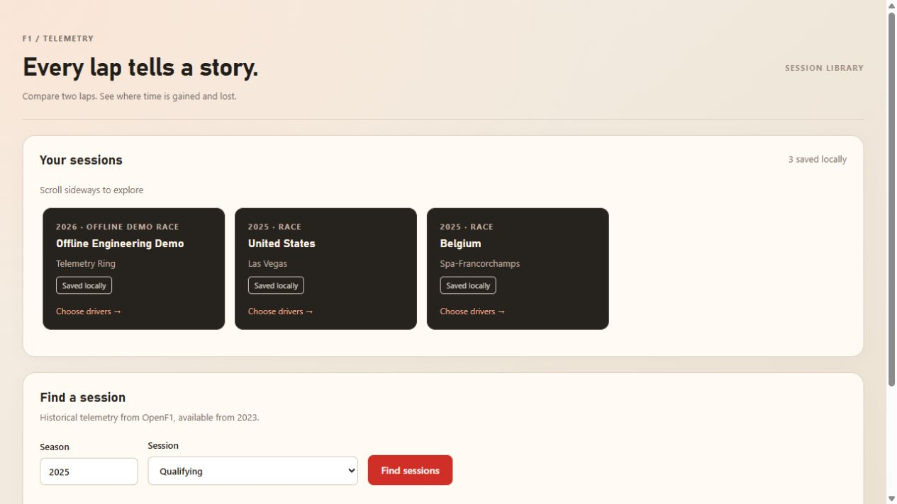

# Formula 1 Telemetry Platform

A web application for importing, caching and comparing historical Formula 1 laps from OpenF1. Built with React, TypeScript, Node.js, Express, Prisma and PostgreSQL.

## Screenshot



The screenshot shows a local installation with previously saved sessions. A fresh database starts empty.

## Requirements

- Node.js 20.3 or newer (Node.js 22/24 recommended)
- PostgreSQL running locally or at the host configured in DATABASE_URL
- Internet access to import new OpenF1 data
- PowerShell and PostgreSQL's `psql` for the optional Windows database-creation helper

## First launch (PowerShell)

Clone the repository, then run commands from its root:

```sh
git clone https://github.com/punkerluv66/f1_telemetry.git
cd f1_telemetry
```

```powershell
npm ci
Copy-Item .env.example .env
# Edit DATABASE_URL in .env to match your PostgreSQL credentials.
npm run db:create
npm run db:migrate
npm run dev
```

Do not overwrite an existing .env. It is ignored by Git. The API resolves the root .env by its file location, so npm workspaces do not change which configuration is loaded. On macOS/Linux, use `cp .env.example .env` and create the database with your PostgreSQL tools instead of the PowerShell `db:create` helper. The remaining npm commands are the same.

Frontend: http://localhost:5173 · API: http://localhost:4000/api/health

The example URL is a local development example, not a production credential. db:create reads it from .env and requires psql. If the database already exists, skip db:create. For an existing installation previously managed with db push, use npm run db:push to synchronize the schema; migrate deploy expects the initial migration to be unapplied to an empty database or explicitly baselined.

## Regular use

```powershell
npm run dev
```

Browse the horizontal session cards or import a historical session from the search results. Choose two drivers from the vertically scrollable classification lists. Race and Sprint sessions show race pace and stint summaries immediately; lap selection follows below. Qualifying sessions go straight to lap selection. Fastest eligible laps are preselected, and Change drivers reopens the driver lists. Cached sessions can be opened without searching OpenF1. Initial telemetry loading is slower than later comparisons because upstream requests are queued.

For a production build:

```powershell
npm run build
npm start
```

The API serves the compiled web application at http://localhost:4000. Restart dev processes after changing environment variables.

## API

- GET /api/health
- GET /api/openf1/sessions?year=2025&sessionName=Qualifying
- POST /api/sessions/import with { "sessionKey": 12345 }
- GET /api/sessions
- GET /api/sessions/:sessionId/overview
- POST /api/analysis/compare with sessionId, referenceLapId, targetLapId, distanceStep (5–100 m) and smoothingWindow (odd, 1–21)

Invalid inputs return 400, missing resources 404, unsuitable telemetry 422, upstream failures 502/503/504 and unavailable database 503. Overview requests only read stored data. Reimporting refreshes metadata atomically and invalidates affected caches.

## Calculation method and limitations

Telemetry is fetched with a one-second margin, deduplicated by timestamp and clipped to explicit official lap boundaries. Speed at the boundaries is interpolated where bracketing samples exist; short missing edges use the nearest sample. Missing edges over 750 ms and internal gaps over 2 s are rejected. Quality metadata accompanies each comparison.

Distance is estimated by trapezoidal integration of speed. Both laps use a symmetric common length (the mean of their integrated lengths). When both laps have complete, positive sector times whose sum matches the lap within 3 ms, their distance axes are scaled piecewise between start, S1, S2 and finish. Common sector distances are the mean of both laps' globally scaled distances at those timing boundaries. Timestamps and measured channels remain unchanged. Explicit sector points are included in the display grid; artificial anchor points do not count as sensor samples during smoothing.

Missing/inconsistent sector timing, insufficient boundary coverage or a sector needing over 10% extra distance scaling causes a documented fallback to whole-lap scaling. Invalid or non-increasing source timestamps are rejected. The 3 ms tolerance handles timing rounding; the 10% limit is a plausibility guard, not an accuracy bound. The API reports the method, anchor times and segment scale factors under `quality.sectorAlignment`. Agreement at anchors is enforced, not independent validation. Positions and interior mini-sector times remain approximate: this is not projection onto a surveyed circuit centerline. Mini-sectors use the prepared source timeline directly, so display grid spacing and smoothing do not change their results. Payload version 9 invalidates earlier comparison results without reimporting telemetry.

A moving average smooths speed and throttle only. Brake is binary pedal state (0/100), not pressure; gear uses previous-value interpolation. Braking events are detected before visual smoothing. Numbered zones are detected braking regions, not official circuit corner numbers. Stint pace is descriptive and is not a tyre degradation model.

Charts cache their geometry and use binary search for cursor sampling. Large SVG traces retain bucket endpoints and extrema at screen resolution; calculations and cursor values retain every sample. Optional profiling commands are described below. No automated test suite is included in the tracked application.

The application is designed for one API process. Request queues and import locks are in memory. Horizontal scaling and live telemetry are outside its current scope.

## Troubleshooting

- Missing DATABASE_URL: create .env at the repository root and restart the API.
- Outdated Prisma types during build: run `npm run prisma:generate -w @f1/api` and rebuild.
- Database unavailable / missing tables: check credentials and run db:migrate for a fresh database, or db:push for an existing schema.
- Vite ECONNREFUSED: the API must be running on port 4000; check its terminal output first.
- OpenF1 busy or incomplete telemetry: retry later or choose another clean lap.

## Delta and mini-sectors

All signed deltas use left/reference minus right/comparison: positive means the left lap is slower, negative means it is faster. The same convention is used for the full lap, charts, official sectors, braking zones and exported report. Twenty equal-distance mini-sectors show estimated time spent in each section, not cumulative delta or official timing sectors. Selecting one highlights its distance range on the charts. Stint pace is available for Race and Sprint only.

## Selection and profiling

Race charts show recorded pit stops and tyre stint bands. Each lap selector can be filtered by stint. The same driver may be selected on both sides with different laps. The optional Gear chart uses step interpolation. Driver numbers, lap numbers, stint filters and valid analysis settings are kept in the URL; Copy selection link produces a reusable URL. Opening a link restores the selection; Compare laps explicitly starts analysis.

The comparison endpoint also accepts `Accept: application/x-ndjson` to stream actual queued/loading/calculating stages followed by a result. Validation errors before the stream retain HTTP error statuses; errors after streaming starts are `type: error` records. Consumers must require a `type: result` record before considering a streamed request successful. The regular JSON endpoint remains available.

Run `npm run profile:ui` for the standalone production-mode chart workload on port 4174.

For API profiling, import and compare laps first so that cached data exists. Build the application, then start it on port 4001 in PowerShell:

```powershell
$env:PORT = 4001
npm start
```

On macOS/Linux, use `PORT=4001 npm start`. In another terminal, run `npm run profile:api` (override the target with `PROFILE_URL`). Generated results are saved under `.profiling/results/` and ignored by Git. The scripts are local profiling tools, not an automated test suite or a performance guarantee.

## Code layout

- `apps/api/src/services/analysisService.ts`: telemetry processing and lap comparisons.
- `apps/api/src/services/sessionImportService.ts`: session ingestion and caching.
- `apps/api/src/lib/openf1.ts`: upstream data requests.
- `apps/api/prisma/`: database schema and migrations.
- `apps/web/src/`: pages, charts and other interface components.
- `scripts/`: database and profiling helpers.
